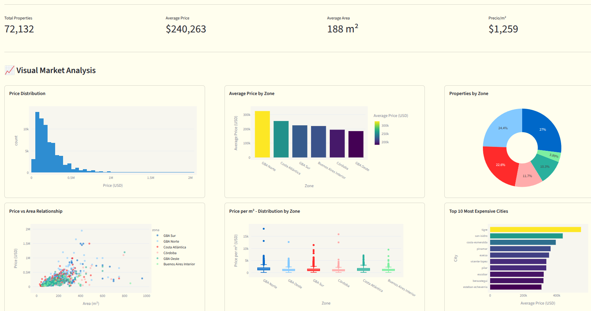

<h1 align="center">Valentín González Daumes</h1>

 

I'm 23 years old, a computer engineering student, and this is my personal portfolio. It focuses on projects related to data extraction, processing, and analysis.

 

## Main projects

<table>

<tr>
<td width="50%">
<h3 align="center">Oikos</h3>

Draw a house plan in a SVG canvas, indicate the location, and predict its value based on a huge dataset of properties in Argentina.

</td>

<td width="50%">
<h3 align="center">Argentina Housing Dashboard</h3>

A dashboard created from the analysis of over 72,000 properties extracted by an interval scraper. It includes graphs and dataset exploration.

</td>

</table>

## Skills

#### Languages

&nbsp;
&nbsp;

#### ML/DL

&nbsp;

&nbsp;
&nbsp;

#### Scraping

#### Testing

#### Database

#### Tools and Technologies

&nbsp;
&nbsp;

#### IDEs

&nbsp;
&nbsp;
